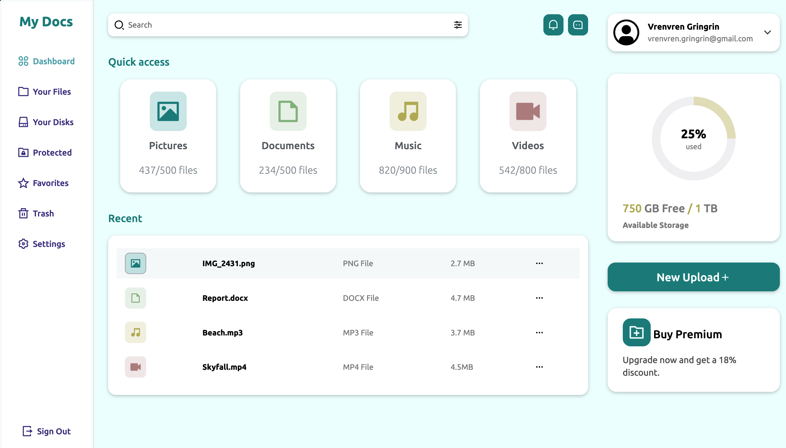

# File Sharing Platform Dashboard

A modern, responsive file management dashboard built with pure HTML and CSS. Features a clean three-panel layout with sidebar navigation, file listing, quick access widgets, and storage monitoring.

## ✨ Features

- **Responsive Design** - Adapts seamlessly to desktop, tablet, and mobile devices
- **Three-Panel Layout** - Sidebar navigation, main content area, and right widgets panel
- **Interactive Elements** - Hover effects, active states, and smooth transitions
- **File Management UI** - Quick access to Pictures, Documents, Music, Videos
- **Recent Files Table** - Clickable file list with icons and metadata
- **Storage Monitoring** - Visual disk usage progress indicator
- **User Profile** - Account information and dropdown
- **Modern UI** - Glassmorphism effects, gradients, and smooth animations

## 📱 Responsive Breakpoints

- ↔️ @media screen and (max-width: 1230px)
- ↔️ @media screen and (max-width: 992px)
- ↔️ @media screen and (max-width: 768px)
- ↔️ @media screen and (max-width: 576px)

## 👨‍💻 Visuals

